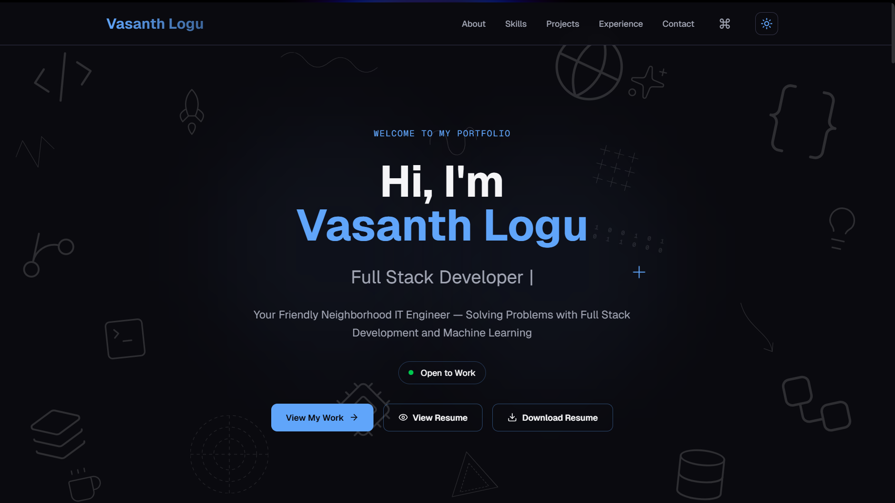

# 🚀 Personal Portfolio — Vasanth Logu

> IT Undergraduate · Full Stack Developer · ML Engineer

[](https://nextjs.org/)
[](https://react.dev/)
[](https://tailwindcss.com/)
[](https://www.typescriptlang.org/)
[](https://vercel.com/)
[](LICENSE)

Live site → **[vasanthlogu.vercel.app](https://vasanthlogu.vercel.app)**

---

## 📸 Preview



---

## ✨ Features

- **Bold dark UI** with electric blue accent and modern typography
- **Developer doodle background** — subtle tech-themed SVG illustrations scattered across the hero (code brackets, terminal, rocket, globe, database, starburst and more)
- **Custom crosshair cursor** — clean `+` symbol replacing the default OS cursor
- **Animated skill bars** with staggered scroll-triggered fill and live counter
- **3D tilt on project cards** — cards rotate in perspective on mouse hover
- **Filterable project grid** — filter cards live by tech stack tag
- **Project detail modals** — click any card for full description, tech stack, and links
- **Terminal-style about section** — CLI typewriter animation triggered on scroll
- **Chat-style contact form** — conversational UI wired to Resend API via Vercel serverless function
- **CMD+K command palette** — keyboard navigation, section jumping, theme toggle
- **Dark / light mode toggle** — persisted to localStorage, respects system preference
- **Scroll progress bar** — thin accent line fills at the top as you scroll
- **Text scramble effect** — hero headline shuffles characters on page load
- **Currently section** — live cards showing what I'm building, learning, and reading
- **Live status badge** — pulsing "Open to Work" pill in the hero section
- **Scroll restoration** — page remembers scroll position on navigation
- **Custom hooks** — `useMobile`, `useToast`, `useScrollAnimation` for clean logic separation
- **Fully responsive** — mobile, tablet, desktop
- **Accessible** — semantic HTML, keyboard navigable, `prefers-reduced-motion` respected

---

## 🛠️ Tech Stack

| Layer | Technology |
|---|---|
| Framework | Next.js 15 (App Router) |
| Language | TypeScript |
| UI | React 19, Tailwind CSS |
| Animations | CSS Intersection Observer, requestAnimationFrame |
| Background | SVG developer doodle illustrations |
| Custom cursor | CSS crosshair (`custom-cursor.tsx`) |
| Email | Resend API + Vercel Serverless Function |
| Fonts | Inter / Space Grotesk (Google Fonts) |
| Deployment | Vercel |
| Version control | GitHub |

---

## 📁 Project Structure

```
portfolio/
├── src/
│   ├── app/
│   │   ├── layout.tsx
│   │   ├── page.tsx
│   │   └── globals.css
│   ├── components/
│   │   ├── ui/                         # Reusable shadcn/ui primitives
│   │   ├── about.tsx
│   │   ├── animated-skill-bars.tsx     # Scroll-triggered skill bars with counter
│   │   ├── chat-contact-form.tsx       # Conversational contact form
│   │   ├── command-palette.tsx         # CMD+K spotlight palette
│   │   ├── contact.tsx
│   │   ├── currently-section.tsx       # Currently building/learning/reading
│   │   ├── custom-cursor.tsx           # Crosshair + cursor
│   │   ├── doodle-background.tsx       # SVG tech doodles in hero background
│   │   ├── experience.tsx
│   │   ├── footer.tsx
│   │   ├── hero.tsx
│   │   ├── live-status-badge.tsx       # Pulsing "Open to Work" badge
│   │   ├── navbar.tsx
│   │   ├── project-card-3d-tilt.tsx    # 3D perspective tilt on hover
│   │   ├── project-filter.tsx          # Tech tag filter buttons
│   │   ├── project-modal.tsx           # Project detail modal/drawer
│   │   ├── projects.tsx
│   │   ├── scroll-progress.tsx         # Top progress bar
│   │   ├── scroll-restorer.tsx         # Scroll position restoration
│   │   ├── skills.tsx
│   │   ├── terminal-about.tsx          # CLI typewriter about section
│   │   ├── text-scramble.tsx           # Character shuffle effect on hero name
│   │   ├── theme-provider.tsx          # Dark/light mode context
│   │   └── theme-toggle.tsx            # Sun/moon toggle button
│   ├── hooks/
│   │   ├── use-mobile.ts               # Mobile detection hook
│   │   ├── use-toast.ts                # Toast notification hook
│   │   └── useScrollAnimation.ts       # Intersection Observer scroll hook
│   └── lib/
│       ├── resume.ts                   # Resume data — experience, education
│       └── utils.ts                    # Utility functions (cn, etc.)
├── api/
│   └── contact.js                      # Vercel serverless function — Resend
├── public/
│   └── resume.pdf                      # Resume file (linked from hero)
├── .env.local                          # Environment variables (not committed)
├── next.config.ts
├── tailwind.config.ts
├── tsconfig.json
└── package.json
```

---

## 🚀 Getting Started

### Prerequisites

- Node.js 18+
- npm or yarn
- A [Resend](https://resend.com) account (free) for the contact form

### Installation

```bash
# 1. Clone the repository
git clone https://github.com/vasanthlogu/portfolio.git
cd portfolio

# 2. Install dependencies
npm install

# 3. Set up environment variables
cp .env.example .env.local
# Edit .env.local and add your Resend API key

# 4. Run the development server
npm run dev
```

Open [http://localhost:3000](http://localhost:3000) in your browser.

---

## 🔑 Environment Variables

Create a `.env.local` file in the root directory:

```env
# Get this from resend.com → API Keys
RESEND_API_KEY=re_xxxxxxxxxxxxxxxxxxxx
```

> ⚠️ Never commit `.env.local` to GitHub. It is already in `.gitignore`.

---

## 📧 Contact Form Setup

The contact form uses a Vercel Serverless Function (`/api/contact.js`) with the [Resend](https://resend.com) email API.

**To set it up:**

1. Sign up at [resend.com](https://resend.com) — free plan gives 3,000 emails/month
2. Create an API key
3. Add `RESEND_API_KEY` to `.env.local` for local development
4. Add the same key in **Vercel Dashboard → Project → Settings → Environment Variables**
5. In `/api/contact.js`, replace `YOUR_EMAIL@gmail.com` with your actual email

---

## 🌍 Deployment

This project is deployed on **Vercel** with zero configuration.

```bash
# Deploy via Vercel CLI
npm i -g vercel
vercel

# Or push to GitHub — Vercel auto-deploys on every push to main
git push origin main
```

**After deploying, add the environment variable in Vercel:**

Vercel Dashboard → Your Project → Settings → Environment Variables → Add `RESEND_API_KEY`

---

## 🎨 Customization

To make this your own, update these files:

| What to change | Where |
|---|---|
| Name, tagline, bio | `src/components/hero.tsx`, `about.tsx` |
| Projects data | `src/components/projects.tsx` |
| Skills and percentages | `src/components/animated-skill-bars.tsx` |
| Work experience / education | `src/lib/resume.ts` |
| Currently building/learning | `src/components/currently-section.tsx` |
| Social links | `src/components/footer.tsx`, `command-palette.tsx` |
| Resume file | Replace `public/resume.pdf` |
| Accent color | `tailwind.config.ts` → `colors.accent` |
| Contact email | `/api/contact.js` → `to:` field |
| Open to Work status | `src/components/live-status-badge.tsx` |

---


<p align="center">
  Built with ❤️ by <a href="https://vasanthlogu.vercel.app">Vasanth Logu</a>
</p>